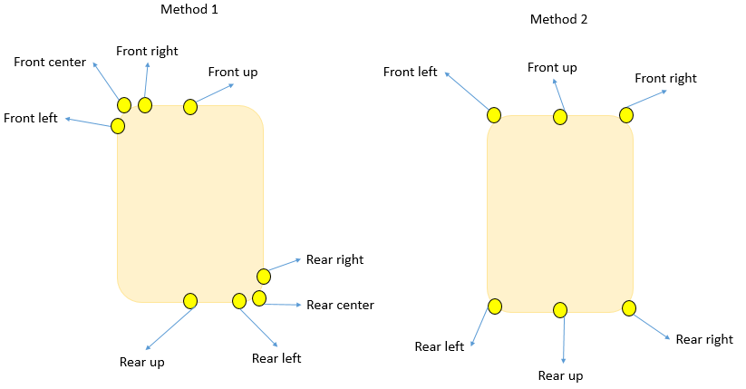
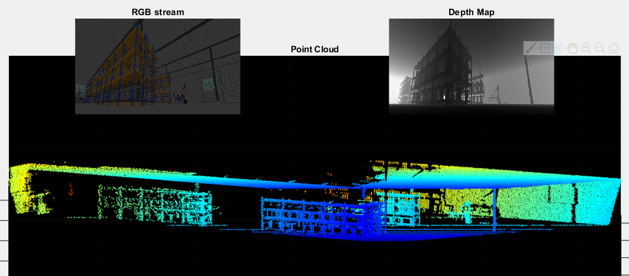
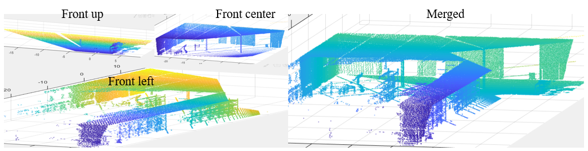
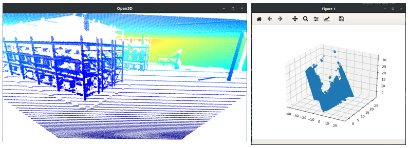

# AGV_data_tools

To use these tools I will use Python and Matlab.

1) First, the 4DVirtualiz dataset should be downloaded from NAS. The data is simulated in two slightly different arrangments (with and without obstable). The data without obstacle is in folder "Vide" and the data with obstacle can be found in folder "Obstacle".
Structure of each folder (Obstacle for example):
```
  Obstacle------
      ----depth----
      ----depth_post---
      ----rgb------
      ----vehicle.csv----
      ----pedestrain.csv-----
      ----pedestrain2.csv------
```
      
Explanation:
  - depth: include raw depth files (.raw format).
  - dpeth_post: include processed depth files with additional noise to make it more realistic.
  - rgb: image file equivalent of the captured depth information.
  - vehicle: information regarding global coordinates (x,y,z) and orientations (yaw, pitch, roll) of the ego vehicle in the scene in a given time stamp.
  - pedestrain: there are 2 pedestrain in the scene. These csv files include their global coordinates and orientations.
  
2) In total, there are 12 sensors attached to the ego vehicle. There are two configurations of sensors for recording data. 
Method one and two. Image below shows the sensor configuration in the two methods.  

Sensors "Front up" and "Rear up" are same for both configurations. 
Each sensor has its own coordinate and orientation values with respect to the center of AGV. All these values can be found in file: 

```
  positions_camera.txt
```
2) How to read data:
RGB files can be read in any environment like a normal image. For example in Matlab imread function can be used. However, for reading depth information we need to now parameters of the sensor that captures the depth image. The captured depth images in the dataset are 500x290. Therefore, every image contains 145000 points. Knowing these values, in Matlab the depth files can be read as:
```
    FID=fopen(fileName,'r');
    DepthImage = fread(FID,500*290*4,'float');
    fclose(FID);
    depthDataRaw = reshape(DepthImage, 500,290);
```
This process can be done similarly in Python.

3) Convert raw depth data to Point cloud:
In order to convert a pixel to 3D real world coordinate characteristic parameters of the sensor (matrix k) is required. Using this information the conversion is performed. This is done using Matlab function `pixel2pts3d`. Input for this function is Matrix k, image coordinate of the given pixel and its depth value. The output is 3D world coordinate.
`k` matrix for the sensors in the simulation is as follow:
```
K = [144.337567297406             0        250
            0          350.060966544099    145
            0                     0         1]
```
Example file `demo_depth_to_3D.m` shows how to use this function to convert depth to point cloud. Given depth and RGB images, it will display RGB, depth image and point cloud of the:


To show point cloud it uses `pcshow` function. To prevent errors, Computer Vision Toolbox should be installed with Matlab, otherwise, another method of display should be used.

The generated x,y,z coordinates of point cloud can be simply saved in a text file or any other conventional point cloud format such as PLY or PCD (using `pcwrite` function).

4) Merging point clouds coming from multiple sensors:
To merge point clouds of different sensors, the points from each individual sensor should be translated to world coordinates. For that we should use extrinsic parameters of each sensor (`positions_camera.txt` file). To carry out those transformations, function `pcTranslate` is used (both in Matlab and Python):
```
outputPtCloud = pcTranslation(inputPtCloud,yaw,pitch,roll, xyzTranslate);
```
given a point cloud (`inputPtCloud`), a theta degree rotation around `z` (yaw), `y` (pitch), and `x` (roll) axes can be applied. Also, given a translation vector `xyzTranslate` the point cloud can be placed in this coordinate in the global coordinate system. for example:
```             
                %rotations
                th_yaw = 0;
                th_pitch = 45;
                th_roll = 0;
                % translation
                c = [1 0 1]';
                ptCloud = pcTranslation(ptCloud,th_yaw,th_pitch,th_roll, c);
```
will perform a rotation around y axis and will translate each point in the point cloud by `c` vector. 
Translation of multiple sensors can be done the same way and at the end they can be merged by `pcmerge` function in Matlab or its Python equivalent (simple matrix concatenation). It should be noticed that the order of rotation around each axis should be respected. A Yaw-Pitch rotation is different from a Pitch-Yaw rotation. The order for the sensors in dataset is Roll-Pitch. Example `demo_sensor_merge` shows an example that data from 3 sensors (center, left and right) are loaded and translated and merged into one point cloud:


Notice that in some Matlab functions parallel processing toolbox is used. Make sure that this toolbox is added or modify parallel sections of the code (such as `parfor`) to sequential. 

4) Python: 
All the functions are provided with a Python version in `my_util.py` library. For visualization `pyplot` can be used. However, for a better visualization installing `Open3D` library is recommended. Below is output of an example (`demo_load_display.py`) that loads and visualizes a point cloud using both Open3D and pyPlot:

For some python functions additional dependancies such as jit may be required. Some libraries at top of utils library may not be required and can be deleted removed to avoid installing additional packages. 


